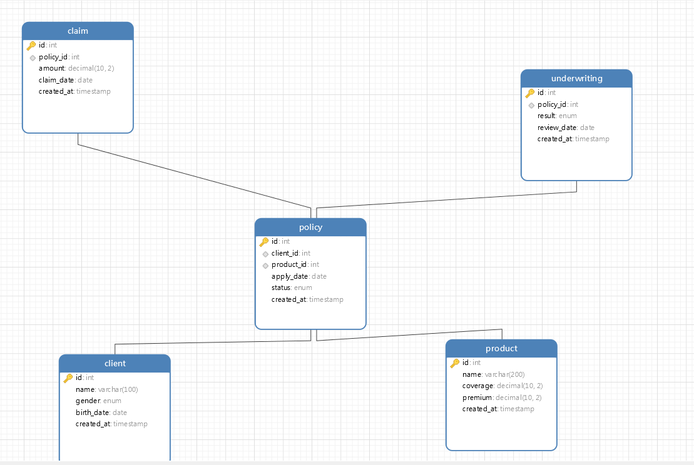

                       人寿保险业务看板
一. 列出所有11个指标
1. 首席再保人或非首席再保人的合同数量占比
   做首席再保人或非首席再保人的合同数量 ÷ 合同总量 × 100%
2. 首席再保人或非首席再保人的保费收入占比

3. 长/短期险保费增长率

4. 长/短期险保费占比

5. 团/个险保费占比

6. 首年期/趸缴保费占比

7. 10年期及以上期缴保费占比

8. 犹豫期保费退保率

9. 新单业务价值占比

10. 资产增量保费比

11. 保费预估差异率

人寿保险主要流程包括以下环节：

投保：客户填写投保申请，提交个人信息、保险产品选择、保额等。

核保：保险公司审核客户资质（如健康状况、收入证明），决定是否承保。

承保：核保通过后，生成正式保单，客户缴纳保费。

保单管理：保单生效后，处理续期缴费、保单变更（如受益人修改）。

理赔：客户提交理赔申请，保险公司审核并赔付。
根据这些业务数据生成 sql表结构
其中的流程
客户提交投保申请 → 核保审核（通过/驳回） → 承保生成保单 → 保费缴纳 → 保单生效 → 理赔触发  

长期险保费增长率	(报告期长期险保费 - 基期长期险保费) / 基期长期险保费 ×100%	policy	insurance_type, premium, report_period
犹豫期退保率	犹豫期撤单保费 / (新单原保费 + 犹豫期撤单保费) ×100%	policy	hesitation_refund_premium, new_premium