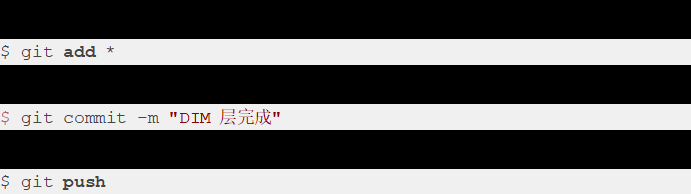

### dim层的优化:
> 业务数据：使用flink CDC 将mysql中的数据信息读取出来，在读取mysql的配置文件 并和并他们 然后使用广播流将其分发到hbase中
> 报错解决是因为没有读取到mysql原始数据，将latest()数据更改为initial()数据并在最后将dim层打包上传进yarn，还有在建表的时候没有给前缀名导致hbase找不到这些表一直报表未存在，其实在hbase中已经存在了，但是未识别到
> 使用./bin/flink run-application -t yarn-application -c com.retailersv1.bim.DbusCdc2Dim_write_Hbase /data/stream-realtime-1.0-SNAPSHOT-jar-with-dependencies.jar命令发送然后使用yarn官网查看是否运行成功
————————————————————————————————————————————————————————————————————————————————
> log数据：使用jar日志生成日志数据直接传到 kafka 然后使用kafka将数据读出来并将脏数据过滤出来，并通过用户id分区分成新老用户，并且进行数据的分流，将不同的流分出去并发送到kafka
> 报错的解决 版本不兼容需要更改 pom 添加版本号
> 使用./bin/flink run-application -t yarn-application -c com.retailersv1.DwdBaseLog /data/stream-realtime-1.0-SNAPSHOT-jar-with-dependencies.jar命令发送然后使用yarn官网查看是否运行成功
### dwd层业务数据的优化：
> 先读取mysql的数据再将其发送到kafka的业务主题中；在使用kafka读取出来做广播分流中的主流
> 再读取mysq中的配置流 ，之后拼接 主流和配置流， 根据配置过滤要的流 ,
> 配置数据的读取与初始化：
在open方法中，首先通过JdbcUtils工具类建立与 MySQL 数据库的连接。连接所需的数据库 URL、用户名和密码均从配置文件中读取。
执行查询语句select * from gmall2023_config.table_process_dim，从数据库中获取配置数据。这些配置数据以TableProcessDim类的对象形式存在。
将获取到的配置数据存储到configMap（一个HashMap）中，其中键为配置数据中的源表名（sourceTable），值为对应的TableProcessDim对象。这一步骤为后续在处理主流数据时提供了配置依据。
>处理配置 ：
> 流接收到json格式的数据并解析它，其分为两部分op操作类型和after数据，在其中提取source_table字段；将op的值为"d"的给删除掉，如果op的值不是"d"，则将jsonObject作为值source_table作为键，放入广播状态中。
——————————————————————————————————————————————————————————————————————————————————————————————————————————————————————————————————————————————
> 主流数据处理:
在processElement方法中，首先通过ctx.getBroadcastState(mapStateDescriptor)获取广播状态，以便获取配置数据。然后从主流的jsonObject（来自 Kafka 的数据）中获取表名（tableName），并尝试从广播状态中获取对应的配置数据（broadData）。
进行数据关联和处理：
检查broadData是否为null，或者本地存储的configMap中是否存在对应表名的数据。如果满足条件，则进一步检查主流数据中的表名是否与配置数据中的源表名（sourceTable）匹配，并且操作类型不是"d"（删除操作）。
若上述条件成立，则进行数据处理操作：
根据配置数据和主流数据构建一个新的JSONObject（记为kafkaData）。kafkaData中包含表名、操作类型和数据内容等信息。
将构建好的kafkaData放入ArrayList（记为list）中，然后通过KafkaUtils.sinkJson2KafkaMessage方法将list中的数据发送到 Kafka 中对应的主题。主题名由配置数据中的sinkTable指定，确保数据能够准确地发送到目标主题进行后续处理。
>>> 然后再进行下一步

